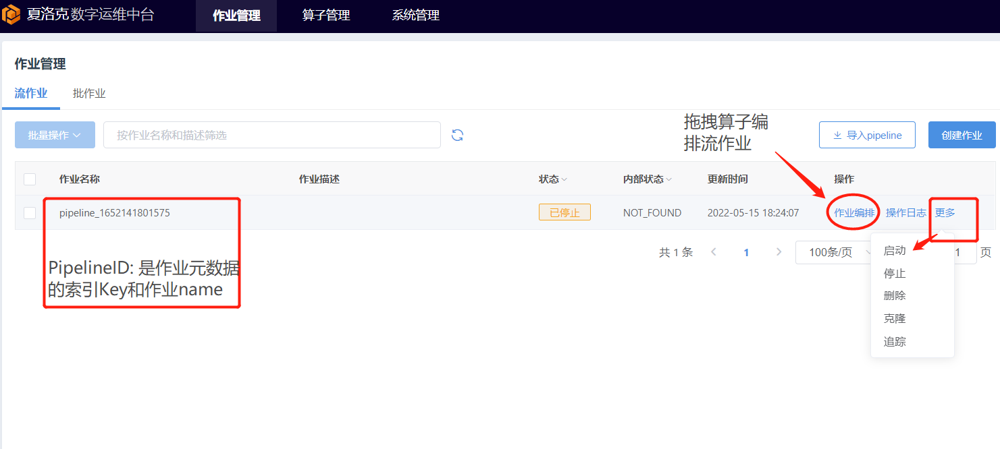
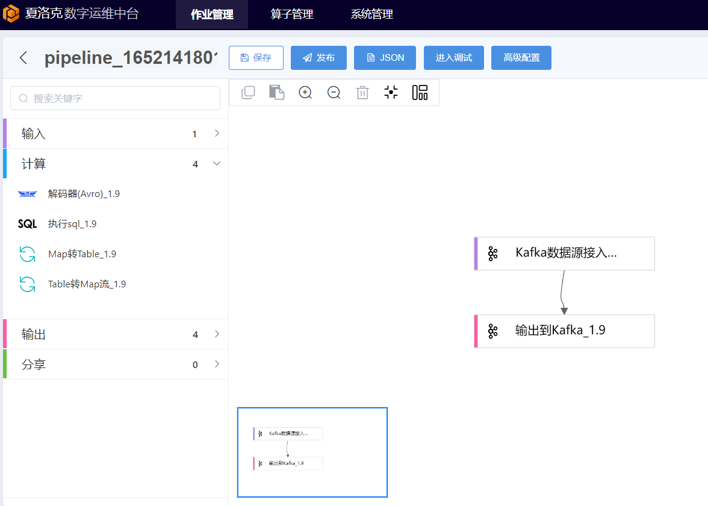
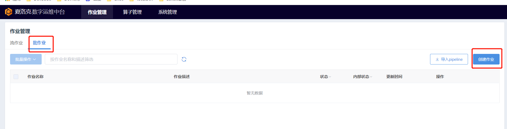
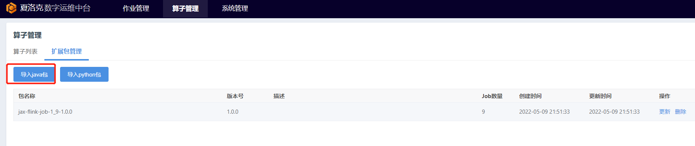
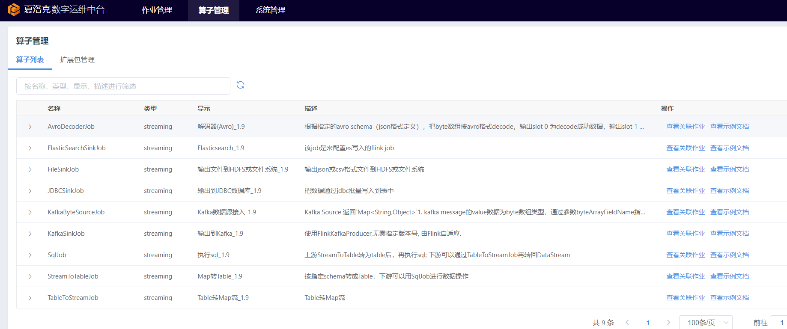
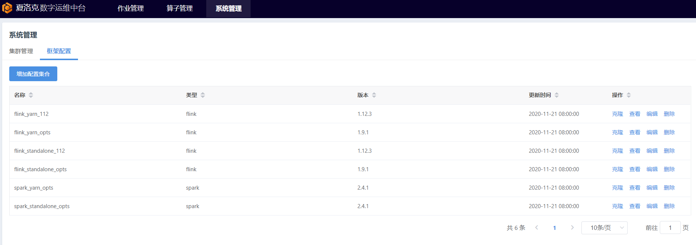
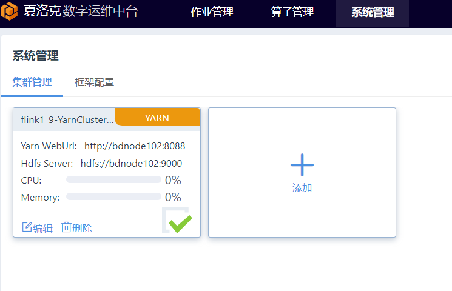

# Jax 功能模块介绍

## 1.作业管理

#### 1.1 流作业开发和管理

流作业模块: 提供基于Flink算子的流任务编排和启停管理

用户可在拖拽出3种不同算子(输入/输出/计算),构建自己的flink DAG计算逻辑;

JAX的可视化编排能够提供用户直观的操作界面，用户得以轻松编排出作业。同时，可视化还提供强大的作业调试功能，用户可以在发布作业前进行调试，以确保逻辑的正确性。

JAX的可视化编排与市面上的其他类似产品是有本质的区别。JAX编排形成的是一个单独的实时处理或离线处理作业。而许多其他产品中的DAG是表示一组作业的相互依赖关系，并通过DAG的描述关系，先后执行其中的作业，其中的作业可以是实时处理也可以是离线作业。
所以JAX的可视化编排更像是给Apache Beam的披上了一层外衣（但JAX底层并不基于Apache Beam），而其他产品更像是Azkaban。可视化作业编排能够同时支持实时(Flink)处理和离线(Spark)处理

#### 1.2 批作业开发和管理

与流作业管理类似, 提供基于Spark的批作业管理

## 2. 算子管理

#### 2.1 拓展包管理

扩展包用于扩展可视化作业编排、SQL作业、机器学习工作台中的算子。可使用编译自带的 

用户可以通过编写Java或Python代码，实现自定义的算子。JAX能通过扩展包管理功能识别这些算子，从而在上述功能中直接使用。

有了扩展包的支持，可以说JAX平台的能力得以无限扩展。用户只需要编写算子的核心的处理代码，无需开发前端的表单，JAX能够自动识别参数，并转化为表单。

#### 2.2 算子列表: 

算子管理模块主要展示[拓展包管理]中加载的各算子详情; 

## 3. 系统管理

#### 3.1 框架管理

关键管理用于定义Flink或Spark计算框架的基础配置和环境变量; 
框架管理提供类似模块的功能, 将自带的flink/spark安装包结合默认参数提供给用户开箱即用; 
用户可根据自身需要参考框架模板,配置自定义的 flink/spark计算引擎和相关参数;

#### 3.2 集群管理

集群是JAX运行作业的基础设施。集群管理是JAX对接企业中已有的数据平台的基本方法。借此，JAX得以将作业运行在企业已有的数据平台上。

集群管理支持对接常见的大数据平台（Hadoop、CDH、TDH、Fusioninsight、Kubernetes等）。作为轻量级平台，JAX不对集群本身做复杂的管理，仅提供基本的信息展示

